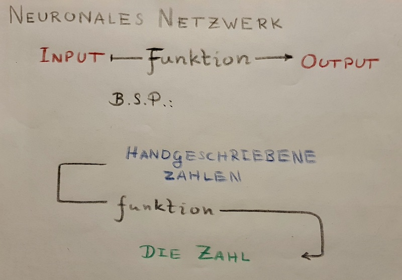
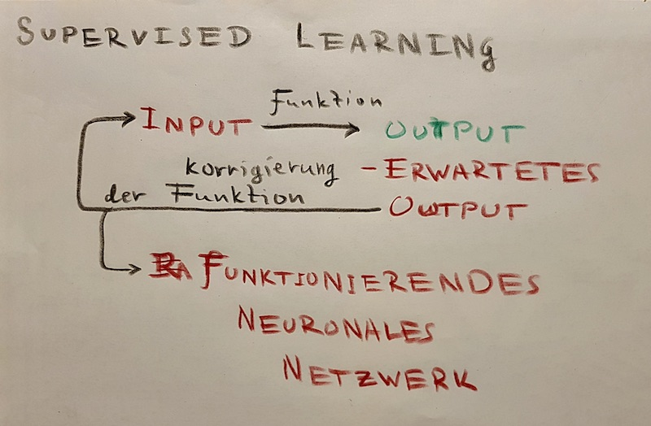
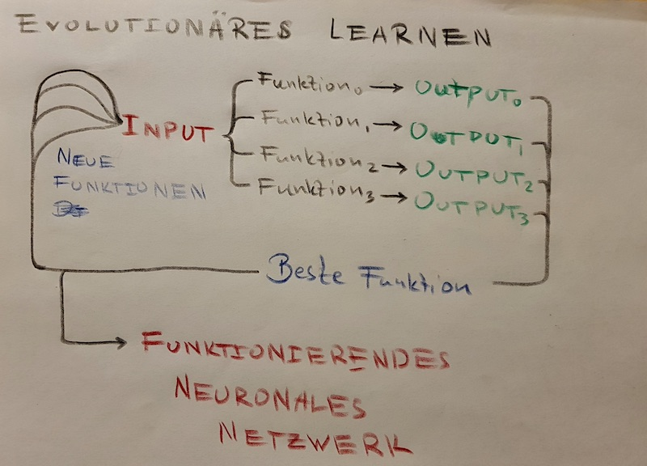

# Einführung zu künstlichen neuronalen Netzwerken

- [Einführung zu künstlichen neuronalen Netzwerken](#einf%c3%bchrung-zu-k%c3%bcnstlichen-neuronalen-netzwerken)
  - [Das Konzept des künstlichen neuronalen Netzwerks](#das-konzept-des-k%c3%bcnstlichen-neuronalen-netzwerks)
  - [Der Nutzen der künstlichen neuronalen Netzwerke](#der-nutzen-der-k%c3%bcnstlichen-neuronalen-netzwerke)
  - [Die Funktionsweise ganz einfach betrachtet](#die-funktionsweise-ganz-einfach-betrachtet)
    - [Supervised Learning einfach erklärt](#supervised-learning-einfach-erkl%c3%a4rt)
    - [Neuro-Evolution einfach erklärt](#neuro-evolution-einfach-erkl%c3%a4rt)
  - [Mathematische Darstellung der Konzepte](#mathematische-darstellung-der-konzepte)
    - [Die Mathmatik hinter Supervised Learning](#die-mathmatik-hinter-supervised-learning)
    - [Die Mathmatik hinter Neuro-Evolution](#die-mathmatik-hinter-neuro-evolution)

## Das Konzept des künstlichen neuronalen Netzwerks
- Die Inspiration der neuronalen Netzwerken ist das menschliche Gehirn.
## Der Nutzen der künstlichen neuronalen Netzwerke

## Die Funktionsweise ganz einfach betrachtet

### Supervised Learning einfach erklärt

### Neuro-Evolution einfach erklärt

## Mathematische Darstellung der Konzepte

### Die Mathmatik hinter Supervised Learning

### Die Mathmatik hinter Neuro-Evolution
